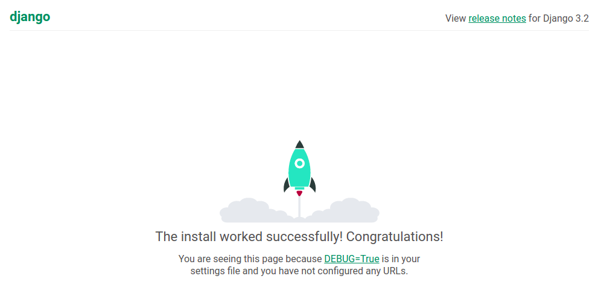

# Technical Writing Assignment: Deploy Django a Server, Start to Finish
Grayson Pike, April 2021

## Summary
This tutorial covers the deployment of a blank Django project to a publicly accessible server. This includes using a domain name and configuring SSL with Let's Encrypt. Written for Ubuntu 18 or 20, this tutorial uses Gunicorn to process requests, and Nginx as a reverse proxy. Gunicorn and Nginx communicate via a socket. The Gunicorn service and socket are managed by Systemd.

## Audience
This tutorial is intended for moderately experienced web developers who have little or no experience deploying a website. This tutorial assumes little to no prior experience with Django.

## Requirements
- DigitalOcean Droplet or other remote Ubuntu 18.04+ server
- A domain name
- An empty Git repository
- Python 3.8+

## Tutorial Outline
- Create a Virtual Environment in your repository, install dependencies
- Create a Django app inside your repository
- Clone the project to your remote server
- Configure Gunicorn Service and Socket with Systemd
- Create an Nginx site and enable it
- Enable SSL for your Nginx reverse proxy

## DNS Configuration
We will start by configuring our DNS. Because DNS takes some time to update, you can be working on the rest of the tutorial in the meantime.

In the domain dashboard of your domain provider's website, create an A record for host `www` that points your domain to the public IP address of your remote server.


## Virtual Environment
In order to install dependencies, you should use a [Python virtual environment](https://docs.python.org/3/library/venv.html). To create a virtual env, use the venv feature of python3. Run the command below in the root project directory. The recommended folder name for the virtual environment is `env`.

```
python3.8 -m venv <env-folder-name>
```

To activate that virtual environment, use the command:
```
source <env-folder-name>/bin/activate
```

After activating, install the requirements.
```
pip install wheel django gunicorn
```

Then, save the requirements to a requirements.txt file.
```
pip freeze > requirements.txt
```

You should now have a file `requirements.txt` with approximately the following contents:
```
asgiref==3.3.4
Django==3.2
gunicorn==20.1.0
pytz==2021.1
sqlparse==0.4.1
```

## Create Your Django Project
In an empty repository, run
```
django-admin startproject <name>
```

Perform the database migrations. This creates your initial blank database.
```
python manage.py migrate
```

Configure your static directory by adding the following line to the end of your `settings.py` file.
```
STATIC_ROOT = os.path.join(BASE_DIR, 'static/')
```

and don't forget to import `os` as well. (still in `settings.py`)
```
import os
```

Add your default Django app (created with the same name as your Django project) to your `INSTALLED_APPS` in `settings.py`:
```
INSTALLED_APPS = [
    'django.contrib.admin',
    ...
    'django.contrib.messages',
    'django.contrib.staticfiles',
    'myapp',   <--- here
]
```

Finally, allow the server to host from your domain in `settings.py`.
```
ALLOWED_HOSTS = ['www.tutorial.com', ]
```

You should now be able to run the development server without errors and view a generic starting page on `localhost:8000`.
```
python manage.py runserver
```


## Clone On Remote Server
Log into your remote Ubuntu 18/20/+ server (I personally use DigitalOcean Droplets). Clone the repository to an easy to access place, such as your home directory.

Ensure Python 3.8 or higher is installed and perform the same steps as before:
- Create a virtual environment inside of the repository.
- `pip install -r requirements.txt` to install the requirements you saved before using `pip freeze`.
- `python manage.py migrate` to establish your database.
- `python manage.py collectstatic` to establish your static files directory.
- `python manage.py runserver` to verify that no errors occur.

## Create Gunicorn Service and Socket with Systemd
We will be using Systemd, the startup service manager for Ubuntu, to run our webserver automatically when the server starts. It also provides a convenient interface to check the webserver status and view logs.

To begin, add the following file to `/etc/systemd/system/gunicorn-REPO_NAME.service`, replacing all instances of REPO_NAME and PROJ_NAME with your git repository name and Django project name, respectively.
```
[Unit]
Description=gunicorn daemon for REPO_NAME
Requires=gunicorn-REPO_NAME.socket
After=network.target

[Service]
User=grayson
Group=www-data
WorkingDirectory=/home/grayson/REPO_NAME/PROJ_NAME
ExecStart=/home/grayson/REPO_NAME/env/bin/gunicorn \
          --access-logfile - \
          --workers 3 \
          --bind unix:/run/gunicorn-REPO_NAME.sock \
          PROJ_NAME.wsgi:application

[Install]
WantedBy=multi-user.target
```

in `/etc/systemd/system/gunicorn-REPO_NAME.socket`, create a socket for the Gunicorn worker processes to recieve requests passed on by the Nginx reverse proxy:
```
[Unit]
Description=gunicorn socket for REPO_NAME
[Socket]
ListenStream=/run/gunicorn-REPO_NAME.sock

[Install]
WantedBy=sockets.target
```

Enable your new Systemd service so that it runs on startup:
```
systemctl enable gunicorn-REPO_NAME.service
```

## Create an Nginx Site and Enable It

Nginx acts as a reverse proxy, recieving web requests from the internet and passing them through the socket to the Gunicorn workers.

Create `/etc/nginx/sites-available/REPO_NAME` (with no file extension), where `SERVER_NAME` is your domain name, e.g. `www.tutorial.com`:
```
server {
    listen 80;
    server_name SERVER_NAME;

    location = /favicon.ico { access_log off; log_not_found off; }
    location /static/ {
        root /home/grayson/REPO_NAME/PROJ_NAME;
    }

    location / {
        include proxy_params;
        proxy_pass http://unix:/run/gunicorn-REPO_NAME.sock;
    }
}

```
Symlink the `available` site to make it `enabled` as well:
```
sudo ln -s /etc/nginx/sites-available/REPO_NAME /etc/nginx/sites-enabled
```

Test your nginx configuraiton to make sure there are no errors:
```
sudo nginx -t
```

Restart nginx to apply your changes
```
sudo systemctl restart nginx
```

## Verify That Your Website Is Accessable
In your browser, navigate to your domain. You should see the same Welcome Page as before.

## Configure SSL using Let's Encrypt CertBot


We will set up our Nginx proxy to serve data over HTTPS by installing an SSL cert from Let's Encrypt. Let's Encrypt provides a useful program, CertBot, to help us.

We must first allow HTTPS traffic through the `ufw` firewall. We also delete the leftover (and now redundant) allowance for Nginx.
```
sudo ufw allow 'Nginx Full'
sudo ufw delete allow 'Nginx HTTP'
```

Then, install CertBot.
```
sudo apt install certbot python3-certbot-nginx
```

Run CertBot and use the interactive prompts to secure your website. I would recommend setting the option to redirect all unsecured (HTTP) traffic to HTTPS.
```
sudo certbot --nginx
```

You should now be able to access your website through HTTPS. Congratulations! You can now devlop your Django website, then pull changes on your server when necessary. Make sure to remember to migrate your database, collect static files, and restart the Gunicorn service when you pull new changes.

## Potential Publishers
- DigitalOcean (if they didn't already have a similar article)
- TutorialsPoint
- RealPython

## Further Reading, Similar Articles
You can find further reading from the following articles:

### [DigitalOcean - How To Set Up Django with Postgres, Nginx, and Gunicorn on Ubuntu 18.04](https://www.digitalocean.com/community/tutorials/how-to-set-up-django-with-postgres-nginx-and-gunicorn-on-ubuntu-18-04)
This article covers much of the same content covered here, minus the Django Setup, Domain name, and SSL configuration.

### [GitConnected - How to Deploy a Django Web App on DigitalOcean Ubuntu 20.04 Server](https://levelup.gitconnected.com/how-to-deploy-a-django-web-app-on-digitalocean-ubuntu-20-04-server-a3c082d5294d)
Same as above.
